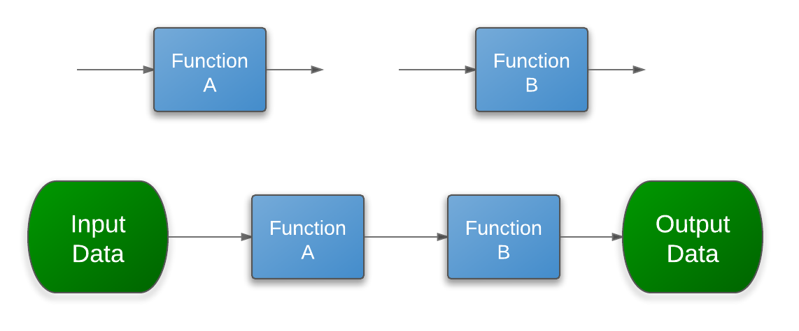

.. include:: ../aux/default_roles.rst

.. container:: centeredtitle

   Errors and Exceptions

----

Syntax Errors
-------------

Wrong usage of Python grammar.

Code fails to be compiled, i.e., code is never run.

.. code-block:: python

    In [9]: a = (b = 3)
      File "<ipython-input-9-2ee64b8087e3>", line 1
        a = (b = 3)
               ^
    SyntaxError: invalid syntax

----

Runtime Errors
--------------

Unlike a syntax error, a runtime error is a valid python code, though
it does not behave as intended.

Code is compiled okay, but an error is encountered while the code is
being executed.

.. code-block:: python

    In [6]: 1/0
    ---------------------------------------------------------------------------
    ZeroDivisionError                         Traceback (most recent call last)
    /home/jjlee/work/SLIDES/2012_python_class/06/<ipython-input-6-05c9758a9c21> in <module>()
    ----> 1 1/0

    ZeroDivisionError: integer division or modulo by zero

    In [7]: sum(3, 5, 7)
    ---------------------------------------------------------------------------
    TypeError                                 Traceback (most recent call last)
    /home/jjlee/work/SLIDES/2012_python_class/06/<ipython-input-7-f5a72734a4a2> in <module>()
    ----> 1 sum(3, 5, 7)

    TypeError: sum expected at most 2 arguments, got 3

    In [8]: '2' + 2
    ---------------------------------------------------------------------------
    TypeError                                 Traceback (most recent call last)
    /home/jjlee/work/SLIDES/2012_python_class/06/<ipython-input-8-4c6dd5170204> in <module>()
    ----> 1 '2' + 2

    TypeError: cannot concatenate 'str' and 'int' objects

----

Syntax Error vs. Runtime Error
------------------------------

- Syntax Error

   .. code-block:: sh

      python -c "print 'I am running'; a = (b = 3)"

   .. code-block:: python

      File "<string>", line 1
        print 'I am running'; a = (b = 3)
                                     ^
      SyntaxError: invalid syntax

- Runtime Error

   .. code-block:: sh

      python -c "print 'I am running'; a = (b = 3)"

   .. code-block:: python

      I am running
      Traceback (most recent call last):
        File "<string>", line 1, in <module>
      ZeroDivisionError: integer division or modulo by zero

----

Exceptions
----------

In Python, errors detected during execution are called
:red:`exceptions` and are not :red:`unconditionally fatal`.

Built-in exceptions
+++++++++++++++++++

ZeroDivisionError, NameError, TypeError, IndexError, KeyError, etc

- http://docs.python.org/library/exceptions.html#bltin-exceptions

----

Handling Exceptions: :red:`try` statement
--------------------------------------------

- Exceptions can be okay sometimes, i.e., can be handled by the program.

- e.g., for **ZeroDivisionError**, assign **None**

.. code-block:: python

    a = 0
    try:
        b = 1/a
    except ZeroDivisionError:
        b = None

----

According to the language reference

.. container:: yellow-bg

   .. code-block:: python

       try_stmt  ::=  try1_stmt | try2_stmt
       try1_stmt ::=  "try" ":" suite
                      ("except" [expression [("as" | ",") target]] ":" suite)+
                      ["else" ":" suite]
                      ["finally" ":" suite]

- The except clause(s) specify **one or more** :red:`exception handlers`.

- When no exception occurs in the try clause, no exception handler is
  executed. An :red:`else`-suite is executed if exists.

- When an exception occurs in the try suite, a search for an exception
  handler is started. This search inspects the :red:`except` clauses
  in turn until one is found that matches the exception.

- If :red:`finally` is present, it is executed after any except and else
  clauses.

.. code-block:: python

    for i in [2, 1, 0, -1, -2]:
        try:
            a = 2/i
        except ZeroDivisionError:
            break
        else:
            print i, a
        finally:
            print "finally with %d" % i

----

Exception handling in nested function calls
-------------------------------------------

- If no except clause matches the exception, :red:`the search for an
  exception handler continues in the surrounding code and on the
  invocation stack`.

.. code-block:: python

    def a():
        1/0

    def b():
        try:
            try:
                a()
            except ValueError:
                pass
        except ValueError:
            pass

    def c():
        try:
            b()
        except ZeroDivisionError:
            print "I'm here!"

    c()

----

Raising an exception by yourself
--------------------------------

.. code-block:: python

   def sqrt(r):
       if r < 0:
          raise ValueError("r must be a non-negative number")

----

Predefined Clean-up Actions
---------------------------

Often, you want :red:`predefined clean-up` actions to be setup for
certain things.

.. code-block:: python

    for line in open("myfile.txt"):
        do_somthing(line)

If an exception is raised, one must make sure that the file is
properly closed.

.. code-block:: python

    f = open("myfile.txt")
    try:
       for line in f:
           do_somthing(line)
    finally:
       f.close()

----

with Statement
--------------

In general,

.. code-block:: python

    set_things_up()
    try:
        use_things()
    finally:
        tear_things_down()

With :red:`with` statement,

.. code-block:: python

    with things:
        use_things()

where

 - :red:`things.__enter__` does set_things_up()

 - :red:`things.__exit__` does tear_things_down()

----

For example, instead of this

.. code-block:: python

    f = open("myfile.txt")
    try:
       for line in f:
           do_somthing(line)
    finally:
       f.close()

you may do

.. code-block:: python

    with open("myfile.txt") as f:
       for line in f:
           do_somthing(line)

Python reference:

.. container:: yellow-bg

   .. code-block:: python

       with_stmt ::= "with" expression ["as" target] ":" suite

**expression** must be an context manager (an object with __enter__
and __exit__ method).

----

.. container:: centeredtitle

    Functional Programing

----

Functional Programing
---------------------

Functional programming decomposes a problem into a set of functions.

- Ideally, :red:`functions only take inputs and produce outputs`, and
  have :red:`no internal state` that affects the output produced for a
  given input.

- Input flows through a set of functions. Each function operates on
  its input and produces some output.

- Functional style discourages functions with side effects that modify
  internal state or make other changes that aren’t visible in the
  function’s return value.

----

Why Functional programming?
---------------------------

http://docs.python.org/howto/functional.html

- Formal provability.

- Modularity.

- Composability.

- Ease of debugging and testing.

Often, functional programming is best fit for applying :red:`functions`
to :red:`a stream of data`.

- **iterable objects**

- functions

----

map, filter & reduce
--------------------

.. code-block:: python

    >>> map(upper, ['sentence', 'fragment'])
    ['SENTENCE', 'FRAGMENT']

.. code-block:: python

   def map(f, *streams):
       result = []
       for i in zip(streams):
         result.append(f(*i))
       return result

   def filter(f, stream):
       result = []
       for i in stream:
         if f(i):
             result.append(i)
       return result

   def reduce(f, stream):
       result = 0
       for i in stream:
         result = f(result, i)
       return result

----

Small Functions
---------------

When writing functional-style programs, you’ll often need little functions.

To write small functions,

- You may use usual :red:`def` statements

- or, use the :red:`lambda` expression

You may consider :red:`lambda` as an anonymous function (with limited
functionality).

.. code-block:: python

   def f_with_def(x):
     return x+2

   f_with_lambda = lambda x: x+2

   f_with_lambda(3) # 5

----

lambda: Handy but Limited
-------------------------

.. container:: yellow-bg

   .. code-block:: python

      lambda_form     ::=  "lambda" [parameter_list]: expression

- lambda can be handy because it is an expression!

.. code-block:: python

   a = map(lambda x: x*x, range(5))
   b = map(lambda x, y: x+y, [1, 2, 3], [3, 4, 5])

- lambda can be limited because it only contains an expression!

- You cannot use statements inside the lambda expression.

----

Operator module
---------------

- lambda is handy for creating a small function.

- but also can be slow.

- for python operators (+, -, \*, etc.), the `operator module
  <http://docs.python.org/library/operator.html>`_ provides these as
  functions.

.. code-block:: python

   # b = map(lambda x, y: x+y, [1, 2, 3], [3, 4, 5])
   import operator
   b = map(operator.add, [1, 2, 3], [3, 4, 5])

- `attrgetter <http://docs.python.org/library/operator.html#operator.attrgetter>`_, `itemgetter <http://docs.python.org/library/operator.html#operator.itemgetter>`_, `methodcaller <http://docs.python.org/library/operator.html#operator.methodcaller>`_

.. code-block:: python

   s="123 "
   f = operator.methodcaller("split")
   f(s) # s.split()

----

itertools & functools
---------------------

- http://docs.python.org/library/itertools.html

- http://docs.python.org/library/functools.html

.. code-block:: python

   from itertools import imap
   b = imap(operator.add, [1, 2, 3], [3, 4, 5])

.. code-block:: python

   import re
   p = re.compile(r"^source(\d\s+)")
   results = map(partial(p.sub, r"source0\1"), open("test.txt"))

----

Example
-------

.. code-block:: text

   # name ra dec
   source1  32.4 14.3
   source2  45.3 -3.5
   source32 81.1 5.3

.. code-block:: python

    result = []
    for l in open("test.txt"):
        l0 = l.strip().split("#")[0]
        if l0:
            l1 = l0.split()
            name, ra_, dec_ = l1
            ra, dec = float(ra_), float(dec_)
            if dec > 0 :
                result.append((name, ra, dec))

----

- direct application of map and filter

.. code-block:: python

    from operator import methodcaller
    s3 = filter(lambda (name, ra, dec): dec > 0,
                map(lambda l0: (l0[0], float(l0[1]), float(l0[2])),
                    map(methodcaller("split"),
                        filter(None,
                               map(lambda l:l.strip().split("#")[0],
                                   open("test.txt"))))))

- more verbose way.

.. code-block:: python

    from operator import methodcaller
    takeout_comments = lambda stream: \
                       filter(None, map(lambda l:l.strip().split("#")[0],
                                        stream))

    split_items = lambda stream: map(methodcaller("split"), stream)

    ra_dec_to_float = lambda stream: \
                      map(lambda l0: (l0[0], float(l0[1]), float(l0[2])),
                          stream)

    filter_positive_dec = lambda stream: \
                          filter(lambda (name, ra, dec): dec > 0,
                                 stream)

    s3 = filter_positive_dec( \
           ra_dec_to_float( \
             split_items( \
               takeout_comments(open("test.txt")))))

----

List Comprehension
------------------

List comprehensions provide a simple way to create lists from other
iterables.

- The resulting list definition tends to be :red:`clearer` than lists
  built using map, filter, etc.

- Each list comprehension consists of

  - an expression followed by a :red:`for` clause

  - then zero or more :red:`for` or :red:`if` clauses.

.. code-block:: python

   r = []
   for i in l:
      r.append(expression)

becomes

.. code-block:: python

   r = [expression for i in l]

----

For example,

.. code-block:: python

   r = [x**2 for x in range(10)]

- If the expression would evaluate to a tuple, it must be
  parenthesized.

Read http://docs.python.org/tutorial/datastructures.html#list-comprehensions.

----

- **for** statements

.. code-block:: python

    result = []
    for l in open("test.txt"):
        l0 = l.strip().split("#")[0]
        if l0:
            l1 = l0.split()
	    result.append(l1)

- **map & filter**

.. code-block:: python

    result0 = filter(None,
                     map(lambda l:l.strip().split("#")[0],
                         open("test.txt")))
    result = map(methodcaller("split"), result0)

-  **list comprehension**

.. code-block:: python

    result0 = [l1.strip().split("#")[0] for l1 in open("test.txt")]
    result = [l2.split() for l2 in result0 if l2]

Note that using list comprehensions often results in more readable
code.  Since only functions can be used with map and filter, things
become a bit ugly.  An arbitrary expression can be used in list
comprehensions.

----

Quick-sort w/ List Comprehension
--------------------------------

- simple but inefficient implementation

.. code-block:: python

    def qsort(L):
        if L == []: return []

        pivot = L[0]

        left = qsort([x for x in L[1:] if x < pivot])
        right = qsort([x for x in L[1:] if x >= pivot])

        return left + [pivot] + right

----

Set comprehension and Dict. comprehension
-----------------------------------------

.. code-block:: python

   a = {"%d" % x for x in [1,2,3]}

   b = {"%d" % x: x*x for x in [1,2,3]}

----

generator expression
--------------------

- A generator expression is a compact generator notation in parentheses.

- Its syntax is the same as for list comprehensions, except that it is
  enclosed in parentheses.

- A generator expression yields a new generator object.

- The parentheses can be omitted on calls with only one argument.

.. code-block:: python

   mygen = (x*x for x in range(10))
   mysum = sum(mygen)

or

.. code-block:: python

   mysum = sum(x*x for x in range(10))

----

.. code-block:: python

    result = []
    for l in open("test.txt"):
        l0 = l.strip().split("#")[0]
        if l0:
            l1 = l0.split()
            name, ra_, dec_ = l1
            ra, dec = float(ra_), float(dec_)
            if dec > 0 :
                result.append((name, ra, dec))

.. code-block:: python

    takeout_comments = lambda stream: \
                       (l.strip().split("#")[0] for l in stream)
    filter_empty_lines = lambda stream: \
                         (l0.split() for l0 in stream if l0)
    ra_dec_to_float = lambda stream: \
                      ((l1[0], float(l1[1]), float(l1[2])) for l1 in stream)
    filter_neg_dec = lambda stream: \
                      (l2 for l2 in stream if l2[2] > 0)

    s3 = list(filter_neg_dec( \
                ra_dec_to_float( \
                  filter_empty_lines( \
                    takeout_comments(open("test.txt"))))))

----

Why use generator?
------------------

A generator is an object with :red:`persistent state`, which can
repeatedly enter and leave the same scope.

- In function, on the other hand, its state is destroyed when function
  returns.

In generators, values are evaluated on demand (lazy evaluation)

.. code-block:: python

   a = range(1000)
   b = [x*x for x in a]
   c = [0.5*xx for xx in b]

.. code-block:: python

   a = xrange(1000)
   b = (x*x for x in a)
   c = list(0.5*xx for xx in b)

- execution sequence

- memory consumption

